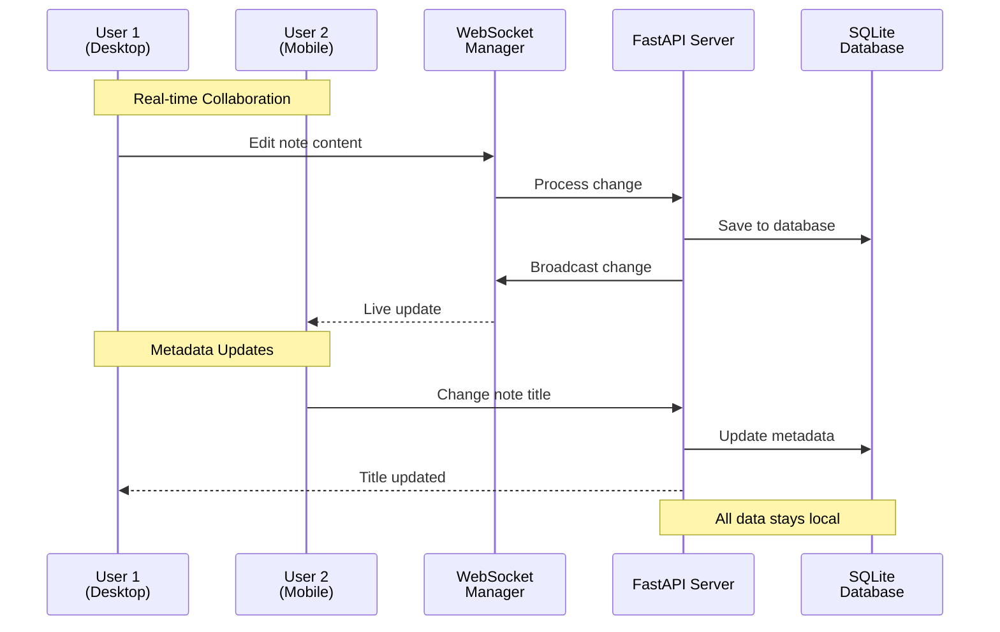

# 📝 Real-Time Notes Pad

A **self-hosted** real-time collaborative note-taking app built with **React**, **FastAPI**, and **WebSockets**—inspired by Google Docs, but designed for privacy-first local networks.

Perfect for families, small teams, and privacy-conscious users who want to keep their notes completely under their control.


## 🔄 Data Flow



### Real-Time vs REST API

- **📡 WebSocket**: Real-time content changes, cursors, typing indicators
- **🔄 REST API**: Initial load, metadata (title, tags), note management
- **💾 Database**: Single source of truth for all data

## 🏠 Self-Hosted Architecture

- 🍓 **Raspberry Pi friendly**: Runs efficiently on ARM devices
- 🔒 **Privacy-first**: Your notes never leave your network
- 🌐 **Multi-platform**: Web, desktop, and mobile apps
- 📱 **Local network**: Fast, low-latency collaboration
- 💾 **SQLite database**: Simple, reliable, zero-config storage

---

## 🚀 Features

- [x] Real-time collaborative editing via WebSocket
- [x] Firebase Authentication (works with self-hosted setup)
- [x] Auto-saving with intelligent debouncing
- [x] Multiple notes management
- [x] Cross-platform clients (Web, Desktop, Mobile)
- [x] Simple backup (single SQLite file)
- [x] Docker deployment
- [ ] Electron desktop app
- [ ] React Native mobile app

---

## 📦 Tech Stack

### Backend (Self-Hosted Server)

- **FastAPI** (Python) - High-performance API
- **SQLite** - Lightweight, serverless database
- **WebSocket** - Real-time communication
- **Firebase Auth** - User management

### Frontend (Multi-Platform)

- **React + TypeScript** - Web application
- **Tailwind CSS** - Styling
- **Electron** - Desktop wrapper
- **React Native** - Mobile apps (planned)

### Deployment

- **Docker** - Containerized deployment
- **Docker Compose** - Single-command setup

---

## 🛠 Quick Start

### Option 1: Docker (Recommended)

```bash
# Clone the repository
git clone https://github.com/jonathas/realtime-notes-pad.git
cd realtime-notes-pad

# Start with Docker Compose
docker-compose up -d

# Access your notes at http://localhost:8000
```

### Option 2: Manual Setup

```bash
# 1. Start the backend
cd backend
python3 -m venv .venv
source .venv/bin/activate
pip install -r requirements.txt
fastapi dev app/main.py

# 2. Start the frontend
cd frontend
npm i
npm run dev
```

### Option 3: Desktop App (Electron)

```bash
# Clone and setup
git clone https://github.com/jonathas/realtime-notes-pad.git
cd realtime-notes-pad

# Install frontend dependencies
cd frontend
npm install

# Run in development mode (starts both web server and Electron)
npm run electron-dev

# Build for production
npm run build-electron

# Create distributable packages
npm run dist
```

---

## 🧪 Testing

### Backend API Tests

The backend includes comprehensive tests covering:

- **Unit tests** - NoteService business logic
- **API tests** - REST endpoints
- **WebSocket tests** - Real-time functionality

```bash
# Navigate to backend directory
cd backend

# Run all tests
pytest

# Run with verbose output
pytest -v

# Run specific test categories
pytest -v -m "not slow"        # Skip performance tests
pytest -v -m "slow"            # Only performance tests
pytest -v -k "websocket"       # Only WebSocket tests

# Run with coverage report
pytest --cov=app --cov-report=html
```

**Test Categories:**

- 🔧 **Unit Tests**: Core business logic (NoteService)
- 🌐 **API Tests**: REST endpoint validation
- 📡 **WebSocket Tests**: Real-time communication

All tests use isolated in-memory databases for fast, reliable testing.

---

## 📁 Project Structure

```bash
realtime-notes-pad/
├── frontend/                 # React web application
│   ├── src/
│   │   ├── components/
│   │   │   ├── Editor/       # Real-time text editor
│   │   │   ├── Toolbar/      # Navigation and controls
│   │   │   └── Modals/       # Settings and note selection
│   │   ├── services/
│   │   │   ├── storage.ts    # API client
│   │   │   ├── firebase.ts   # Authentication
│   │   │   └── websocket.ts  # Real-time communication
│   │   └── hooks/            # React hooks
│   ├── electron/             # Desktop app wrapper
│   │   └── main.js           # Electron main process
│   ├── public/
│   └── package.json
├── backend/                  # FastAPI server
│   ├── app/
│   │   ├── routers/          # API endpoints
│   │   ├── services/         # Business logic
│   │   ├── models/           # Database models
│   │   └── auth/             # Authentication
│   ├── tests/                # Comprehensive test suite
│   │   ├── test_note_service.py    # Unit tests
│   │   ├── test_notes_api.py       # API tests
│   │   ├── test_websockets.py      # WebSocket tests
│   ├── data/                 # SQLite database
│   └── requirements.txt
├── docker-compose.yml        # Development setup
└── README.md
```

---

## 🌐 Client Applications

### Web App

- Access via any modern browser
- Works on desktop and mobile
- Real-time collaboration

### 🖥️ Desktop App (Electron) - ⚠️ Work in Progress

A native desktop wrapper for the web app with enhanced features.


#### ⚠️ Current Status: Not Ready for Production

The Electron app is currently **under development** and missing critical authentication features:

- ❌ **Firebase Authentication**: Google sign-in doesn't work properly in Electron
- ❌ **OAuth Flow**: Browser-based auth redirects don't return to the app
- ❌ **Custom Protocol Handler**: Not yet implemented for auth callbacks

**Built Apps Location:**

- **Development**: Runs from `http://localhost:5173`
- **Production**: Packaged in `dist-electron/` folder

**Planned Features:**

- 🖥️ **Native window**: Proper desktop integration
- 📱 **Cross-platform**: Windows, macOS, and Linux
- 🔐 **Embedded auth**: In-app Google authentication
- 🔄 **Auto-updater ready**: Built-in update mechanism

**For now, please use the web app** at `http://localhost:8000` which has full authentication support.

### 🌐 PWA Features (Connection-Required)

This app is designed as a **connected-only** PWA that requires real-time WebSocket connection:

- 📱 **App-like experience**: Installs like a native app
- 🚀 **Fast loading**: Static assets cached locally
- 🔄 **Smart reconnection**: Automatically reconnects when server available
- 📡 **Connection awareness**: Shows connection status and graceful degradation
- 💾 **No offline storage**: Notes require server connection (by design)

#### Why No Offline Mode?

- Real-time collaboration requires active connections
- Notes are stored securely on your self-hosted server
- Prevents sync conflicts and data loss
- Simpler architecture and better security

### Mobile Apps (Planned)

- React Native for iOS/Android

---

## 🔧 Configuration

### Environment Variables

```bash
# Frontend (.env)
# Firebase Configuration
VITE_FIREBASE_API_KEY=your_api_key_here
VITE_FIREBASE_AUTH_DOMAIN=your-project.firebaseapp.com
VITE_FIREBASE_PROJECT_ID=your-project-id
VITE_FIREBASE_STORAGE_BUCKET=your-project.appspot.com
VITE_FIREBASE_MESSAGING_SENDER_ID=123456789
VITE_FIREBASE_APP_ID=1:123456789:web:abcdef123456

# API Configuration
VITE_API_URL=http://localhost:8000
```

---

## 🔒 Privacy & Security

### Data Privacy

- ✅ **Local storage**: Notes never leave your network
- ✅ **No cloud dependencies**: Works completely offline
- ✅ **Your data, your control**: Easy backups and migrations
- ✅ **Firebase auth only**: User accounts, not note data

### Security Features

- 🔐 **JWT authentication**: Secure user sessions
- 🛡️ **CORS protection**: Configurable origins
- 🔄 **Automatic backups**: SQLite file copying
- 🚫 **No telemetry**: No tracking or analytics

---

## 🔄 Backup & Restore

### Backup Your Notes

```bash
# Simple file copy
cp data/notes.db backups/notes-$(date +%Y%m%d).db
```

### Restore from Backup

```bash
# Stop the service
docker-compose down

# Restore database
cp backups/notes-20240105.db data/notes.db

# Restart
docker-compose up -d
```

---

## 🤝 Use Cases

### Perfect For

- 👨‍👩‍👧‍👦 **Families**: Shared grocery lists, vacation planning
- 🏢 **Small teams**: Meeting notes, project planning
- 🔒 **Privacy-conscious users**: Keep sensitive notes local
- 🏠 **Home labs**: Self-hosted enthusiasts
- 📚 **Students**: Collaborative study notes
- ✍️ **Writers**: Draft sharing and feedback

### Why Self-Hosted?

- **No subscription fees** - One-time setup
- **Complete privacy** - Your data stays home
- **Fast performance** - Local network speed
- **Works offline** - No internet required
- **Customizable** - Modify to fit your needs

---

### Contributing

1. Fork the repository
2. Create a feature branch
3. Make your changes
4. **Run tests**: `cd backend && pytest`
5. Test on Raspberry Pi if possible
6. Submit a pull request

---

## 📜 License

MIT © Jonathas Ribeiro

**Built for self-hosters, by self-hosters** 🏠
